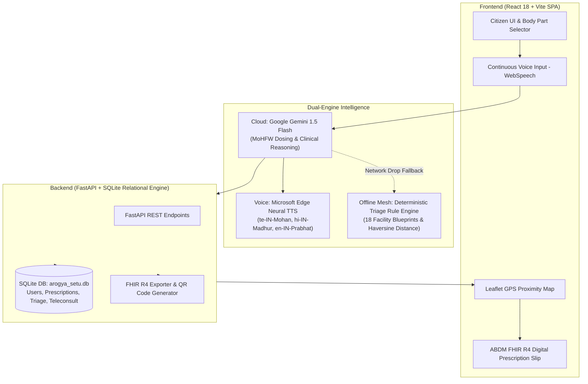

# 🏥 Arogya Setu Local — Technical Stack & Core Codebase Structure
> **Smart India Hackathon 2026** | **Problem ID:** SIH26133  
> **Team:** BioPulse | **Product:** Arogya Setu Local (Rural Health Mesh)

---

## ⚡ The 30-Second Technical Pitch (Memorize for Judges)

> *"Arogya Setu Local is an **offline-resilient, AI-powered rural healthcare mesh** designed for low-connectivity primary health centres (PHCs).  
> 
> * **Frontend**: Built with **React 18, Vite, and Tailwind CSS**, featuring an interactive 2D anatomical body selector, Leaflet GIS hospital proximity radar, and continuous speech recognition across 17 regional Indian languages.
> * **Backend & Storage**: Powered by **FastAPI and SQLite**, managing offline local caching, citizen sessions, and ABDM FHIR R4 clinical compliance.
> * **AI & Multimodal Engines**: Combines **Google Gemini 1.5 Flash** for clinical triage & prescription generation with **Microsoft Edge Neural TTS** for lifelike regional doctor voice synthesis.
> * **Zero-Network Fallback**: When the internet drops, our offline deterministic rule engine and Web Speech synthesizer take over with zero disruption."*

---

## 🏛️ End-to-End System Architecture



---

## 📂 Complete Codebase Structure & File Guide

```
hackathon-2026-aditya/
│
├── 📄 main.py                       # Root ASGI entrypoint (imports and exposes backend FastAPI app)
├── 📄 build.sh                      # Unified build script (auto-installs portable Node.js v20 on Render)
├── 📄 start.sh                      # Render startup script (binds uvicorn to 0.0.0.0:$PORT)
├── 📄 render.yaml                   # Infrastructure-as-Code for Render Cloud deployment
├── 📄 requirements.txt              # Root Python dependencies (FastAPI, uvicorn, gunicorn, edge-tts)
├── 📄 .gitignore                    # Git rules (protects build artifacts and API secrets)
│
├── 📁 backend/                      # FASTAPI BACKEND & RELATIONAL DATABASE LAYER
│   ├── 📄 main.py                   # FastAPI application, CORS middleware, TTS & reports routing, SPA serving
│   ├── 📄 database.py               # SQLite ORM & query functions (users, patient_reports, teleconsult)
│   ├── 📄 triage.py                 # Backend Python emergency triage rule engine & symptom matcher
│   ├── 📄 hospitals.json            # Database of 18+ rural PHCs, CHCs, and Sub-Centres with GPS coords
│   ├── 📄 requirements.txt          # Python package requirements for backend services
│   ├── 📄 build.sh & start.sh       # Standalone backend build/start scripts
│   └── 📄 arogya_setu.db            # Persistent SQLite relational database
│
└── 📁 frontend/                     # REACT 18 + VITE FRONTEND SPA
    ├── 📄 package.json              # NPM dependencies (React, Lucide, Framer-motion, Leaflet, Tailwind)
    ├── 📄 vite.config.js            # Vite configuration with proxy rules for backend API
    ├── 📄 tailwind.config.js        # Medical color palette tokens, typography, and animations
    ├── 📄 index.html                # HTML5 root with meta tags and mobile viewport configuration
    │
    └── 📁 src/
        ├── 📄 App.jsx               # Main SPA Router & layout controller
        ├── 📄 index.css             # Global Tailwind utilities, scrollbars, and touch-target styles
        │
        ├── 📁 context/
        │   └── 📄 AppContext.jsx    # Central state store (Auth, GPS coordinates, Language, Reports, Offline Sync)
        │
        ├── 📁 utils/
        │   ├── 📄 geminiAi.js       # Google Gemini 1.5 Flash clinical triage integration
        │   ├── 📄 teleconsultAi.js  # Doctor AI dialog engine, MoHFW pharmacopoeia dosing & clinical prompts
        │   ├── 📄 elevenLabsVoice.js# Voice proxy: Edge Neural TTS -> ElevenLabs -> Browser Speech Synthesis
        │   ├── 📄 localTriage.js    # Offline deterministic triage mesh & Haversine proximity calculator
        │   └── 📄 featureData.js    # 17-Language dictionaries, medical terminology & FAQs
        │
        └── 📁 components/           # MODULAR UI ATOMS & VIEWS
            ├── 📄 Navbar.jsx        # Navigation header, SOS 108 shortcut, Language toggle & Profile menu
            ├── 📄 Home.jsx          # Interactive dashboard with quick actions, vital stats & live radar
            ├── 📄 SymptomInput.jsx  # Continuous voice recorder, text box & 2D Body Part selector
            ├── 📄 BodyPartSelector.jsx # Visual 2D anatomical selector (Head, Chest, Stomach, Limbs, Bites)
            ├── 📄 Result.jsx        # Triage output: Urgency classification, first aid, & recommended hospital
            ├── 📄 TeleconsultVideoCallModal.jsx # WhatsApp-style video consultation with animated Dr. Rajesh Sharma
            ├── 📄 HistoryView.jsx   # Doctor Prescriptions (Rx), Daily Pill Tracker, & Patient Health Records
            ├── 📄 DigitalHealthSlip.jsx # ABDM-compliant printable digital slip with QR code & print styling
            ├── 📄 HospitalDirectory.jsx # Filterable directory of 18+ PHCs with live GPS distances
            ├── 📄 HospitalMap.jsx   # Interactive Leaflet OpenStreetMap with live radar radius
            ├── 📄 GpsPermissionPrompt.jsx # Multi-tier GPS & IP Geolocation detector with 1-tap district presets
            ├── 📄 AuthModal.jsx     # Citizen profile manager, demographic details & Logout button
            ├── 📄 LoginGate.jsx     # Secure citizen login gate with ABHA / Phone fast demo login
            └── 📄 LanguageToggle.jsx# 1-Tap switcher for 17 Indian regional languages
```

---

## 🔄 Core Data & Logic Flows

### 1. 🎤 Symptom Input ➔ Clinical Triage Flow
1. **Input**: Citizen types, taps 2D Body Map ([`BodyPartSelector.jsx`](file:///c:/Users/RAM/Desktop/hackathon%202026%20aditya/frontend/src/components/BodyPartSelector.jsx)), or speaks into mic via Continuous Speech Recognition ([`VoiceInput.jsx`](file:///c:/Users/RAM/Desktop/hackathon%202026%20aditya/frontend/src/components/VoiceInput.jsx)).
2. **Analysis**: Evaluated via Google Gemini 1.5 Flash ([`geminiAi.js`](file:///c:/Users/RAM/Desktop/hackathon%202026%20aditya/frontend/src/utils/geminiAi.js)).
3. **Offline Fallback**: If offline, [`localTriage.js`](file:///c:/Users/RAM/Desktop/hackathon%202026%20aditya/frontend/src/utils/localTriage.js) executes local keyword matching against national clinical protocols.
4. **Output**: [`Result.jsx`](file:///c:/Users/RAM/Desktop/hackathon%202026%20aditya/frontend/src/components/Result.jsx) renders urgency badge, care advice, immediate first aid, and nearest PHC facility.

---

### 2. 👨‍⚕️ WhatsApp-Style AI Teleconsultation Flow
1. **Video Call**: Citizen clicks "Consult Doctor" ➔ opens [`TeleconsultVideoCallModal.jsx`](file:///c:/Users/RAM/Desktop/hackathon%202026%20aditya/frontend/src/components/TeleconsultVideoCallModal.jsx).
2. **Interactive Dialogue**: Dr. Rajesh Sharma greets in the citizen's native language, repeats their problem, and asks clarifying questions.
3. **Lifelike Voice Synthesis**: Uses Microsoft Edge Neural voices (`te-IN-MohanNeural`, `hi-IN-MadhurNeural`, `en-IN-PrabhatNeural`) via `/api/tts/doctor-voice` ([`backend/main.py`](file:///c:/Users/RAM/Desktop/hackathon%202026%20aditya/backend/main.py)).
4. **Prescription Generation**: Enforces strict MoHFW & Indian Pharmacopoeia market dosing (1 Tablet TDS/BD, exact food timing, duration).
5. **Persistence**: Saves prescription to SQLite database ([`backend/database.py`](file:///c:/Users/RAM/Desktop/hackathon%202026%20aditya/backend/database.py)) and updates [`HistoryView.jsx`](file:///c:/Users/RAM/Desktop/hackathon%202026%20aditya/frontend/src/components/HistoryView.jsx).

---

### 3. 🗺️ Live GPS & Hospital Proximity Radar Flow
1. **Location Detection**: [`AppContext.jsx`](file:///c:/Users/RAM/Desktop/hackathon%202026%20aditya/frontend/src/context/AppContext.jsx) queries browser Geolocation with 1-second timeout + IP Network Geolocation fallback.
2. **Proximity Calculation**: Calculates exact Haversine driving distances (in km) to all 18 nearby PHCs and CHCs.
3. **Interactive Map**: Displayed in [`HospitalMap.jsx`](file:///c:/Users/RAM/Desktop/hackathon%202026%20aditya/frontend/src/components/HospitalMap.jsx) with custom medical markers, route links, and emergency ICU filters.

---

## 🛠️ Technology Stack Matrix

| Layer | Technologies Used | Purpose |
|---|---|---|
| **Frontend Framework** | React 18, Vite 5, JavaScript (ES Modules) | Ultra-fast SPA with instant hot-reloading |
| **Styling & Animation** | Tailwind CSS 3, Framer Motion, Lucide Icons | Responsive modern UI with glassmorphism & micro-interactions |
| **Maps & GIS** | Leaflet 1.9, React-Leaflet, OpenStreetMap | GPS radar, facility markers, distance overlays |
| **Backend API** | Python 3.11, FastAPI, Uvicorn, Gunicorn | High-throughput async REST endpoints |
| **Database** | SQLite3 Relational Engine (`arogya_setu.db`) | Zero-configuration persistent local storage |
| **AI LLM** | Google Gemini 1.5 Flash (Generative AI) | Multilingual clinical reasoning, triage & MoHFW Rx generation |
| **Speech Recognition** | Web Speech API (`webkitSpeechRecognition`) | Continuous microphone speech capture in 17 languages |
| **Neural Voice (TTS)** | Microsoft Edge TTS & ElevenLabs API | High-fidelity Indian regional doctor voice synthesis |
| **Health Standard** | ABDM, FHIR R4, ESI Rural Clinical Protocol | Interoperable national health record standards |
| **Deployment** | Render Cloud Web Services (0.0.0.0 binding) | Full-stack cloud deployment with automated CI/CD |

---

## 💡 Quick Q&A for Judges

**Q: How does this work when there is no internet in rural villages?**  
*A: The entire triage rule engine ([`localTriage.js`](file:///c:/Users/RAM/Desktop/hackathon%202026%20aditya/frontend/src/utils/localTriage.js)), facility proximity calculation, SQLite caching, and browser speech synthesizer operate 100% offline. When internet is restored, records sync automatically.*

**Q: How are medicines and dosages protected from AI hallucinations?**  
*A: Our Gemini clinical prompt strictly enforces standard Indian Pharmacopoeia and MoHFW outpatient dosing rules (e.g. Paracetamol 650mg is restricted to exactly 1 tablet per dose slot, never bulk overdoses).*

**Q: Is patient data compliant with Indian healthcare regulations?**  
*A: Yes. All digital slips and triage records conform to the Ayushman Bharat Digital Mission (ABDM) and FHIR R4 schema format.*
